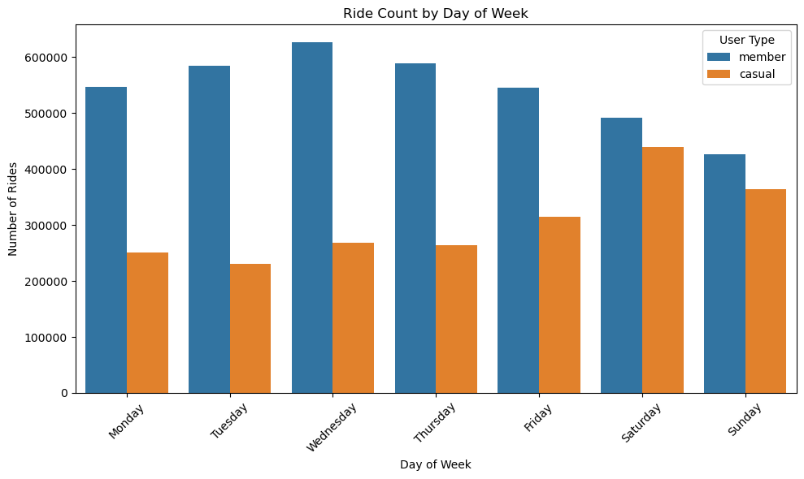
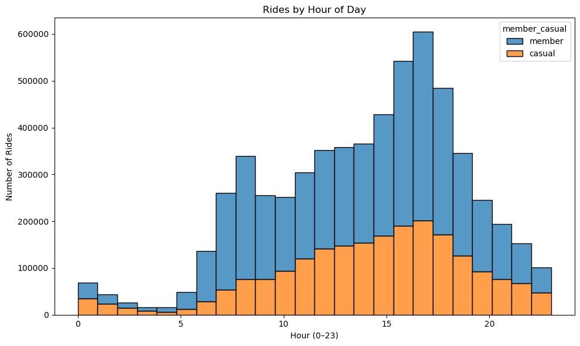
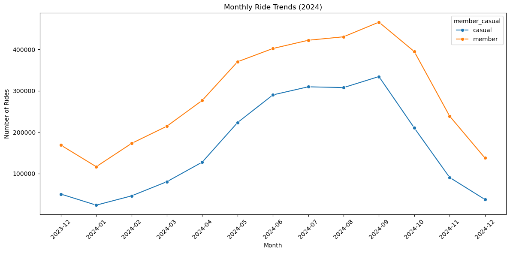
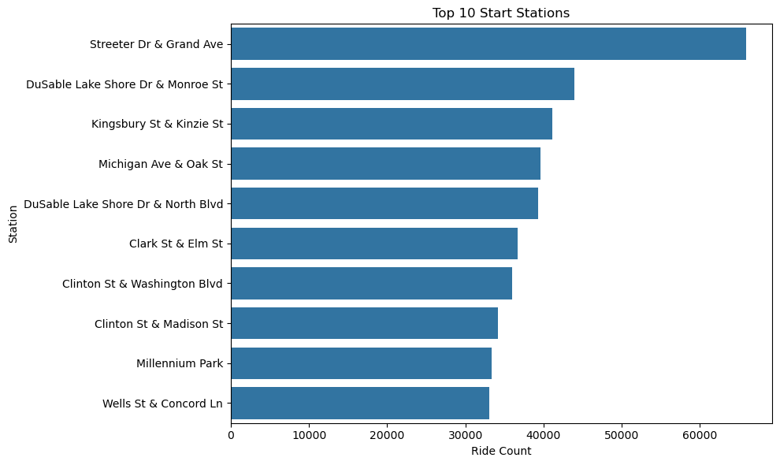

# Divvy Bike Share Analysis 2024

This project analyzes Chicago Divvy Bike Share usage patterns by rider type, time, season, and station activity, then translates the findings into operational recommendations.

It is a general analytics portfolio project for data analyst, business analyst, reporting analyst, and operations analyst roles.

## Business Problem

Bike-share operators need to understand how different rider segments use the system. Usage patterns by day, hour, month, and station can support decisions about bike availability, station planning, rider engagement, and seasonal operations.

## Dataset / Source

- **Source:** Chicago Divvy public trip data
- **Analysis period:** 2024 analysis export, with December 2023 included in the monthly trend chart
- **Raw data note:** The monthly CSV files are not committed to this repository. The notebook expects a local `divvy_data_2024/` folder containing the source CSV files.

## Tools Used

- Python
- pandas
- NumPy
- Matplotlib
- Jupyter Notebook
- HTML notebook export
- Git/GitHub

## Key Questions

- How do member and casual riders differ by day of week?
- What hours of the day show the highest demand?
- How does ridership change by month or season?
- Which start stations have the highest ride counts?
- What operational recommendations follow from these patterns?

## Key Findings

These findings are supported by the committed HTML export and chart images.

- Member riders show higher weekday usage than casual riders.
- Casual rider volume increases on weekends, especially Saturday and Sunday.
- Ride activity peaks in the afternoon and early evening.
- Monthly ride volume rises through warmer months and peaks around late summer.
- Top start stations are concentrated around high-traffic downtown, lakefront, and tourist areas.

## Visuals

### Rider Type by Day of Week



### Usage by Hour



### Monthly Trend



### Top Start Stations



## Business Recommendations

- Increase bike availability around high-demand afternoon and early-evening periods.
- Plan for higher casual rider demand on weekends and during warmer months.
- Monitor top start stations for rebalancing needs during peak season.
- Test promotions that convert frequent casual weekend riders into annual members.
- Use station-level demand patterns to support maintenance and docking-capacity decisions.

## Repository Contents

- `Divvy_2024_Analysis.ipynb` - data-preparation notebook
- `DivvyDataAnalysis.html` - exported analysis with visual outputs
- `docs/images/` - extracted chart images used in this README
- `Divvy_2024_AnalysisREADME.md` - earlier detailed project write-up
- `README.md` - recruiter-facing portfolio summary

## How to Open or Run

To review the analysis without rerunning the notebook:

```bash
open DivvyDataAnalysis.html
```

To rerun the notebook from a fresh clone:

```bash
git clone https://github.com/Juan-R1/divvy-2024-analysis.git
cd divvy-2024-analysis

# Download the monthly Divvy trip CSV files separately.
# Place them in a folder named divvy_data_2024/.

jupyter notebook Divvy_2024_Analysis.ipynb
```

## Limitations

- The raw monthly trip CSV files are not included in this repository.
- The notebook cannot fully rerun from the committed files alone until the source CSVs are downloaded into `divvy_data_2024/`.
- The analysis is descriptive and does not include forecasting or causal modeling.
- Station recommendations should be validated against operational constraints such as bike supply, dock capacity, weather, and maintenance schedules.

## Next Steps

- Add a data-download note with direct source instructions.
- Add a cleaned sample dataset or data dictionary if file-size limits allow.
- Add a Tableau or Power BI dashboard version for non-technical reviewers.
- Add a short executive-summary section with the top three operational actions.

## Resume Bullet

Analyzed Chicago Divvy Bike Share trip patterns using Python and Jupyter to compare member and casual rider behavior, identify time and seasonal demand patterns, and translate findings into operational recommendations.

## LinkedIn Project Blurb

I analyzed Chicago Divvy Bike Share trip data to compare rider behavior by user type, hour, month, and station activity. The project shows how exploratory data analysis can turn operational data into practical recommendations for bike availability, seasonal planning, and rider engagement.
